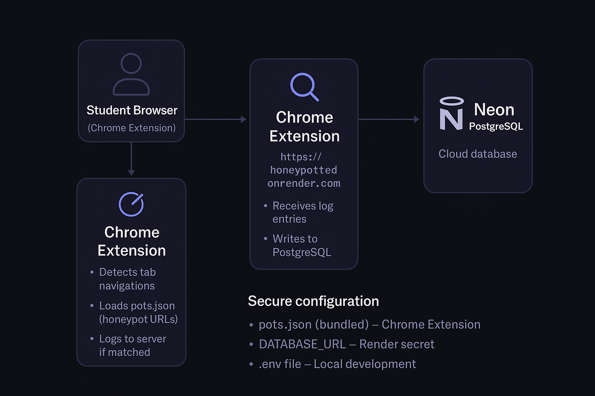
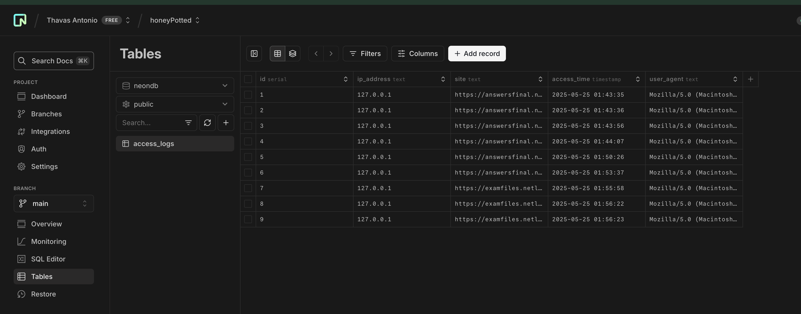

## Purpose

Honorlock is a dumb spy ware type of test monitoring service colleges use. They make use of fake websites with "test material" to find students attempting to find test materials. (**honey pots**)

An unsuspecting student taking a test may access "APCSA final B test answers" during the exam and there IP, time accessed, etc. would be reported leading to diciplanary actions. 

I think this is an infringnment on user privacy so I decided to create my own :)
Its completely free because i'm broke. 

Important to note that if screen was locked, students can use their phone to access test banks. The whole point of honey pots is to stop phone usage. 

You can compare test taking time with site access time. Possibly even run a comparison of ip. 

You can avoid this by using cellular!

## Whats used
- **Flask** – Lightweight web framework to handle logging requests
- **gunicorn** – WSGI server for Flask app (used in production via Render)

### Cloud & Hosting
- **Render** – Hosts the Flask server with HTTPS endpoint (free closed 50 second refresh)
- **Neon** – Cloud PostgreSQL database to store access logs
- **psycopg2** – PostgreSQL database adapter for Python

### Security & Config
- **Render Secrets** – Manage database URLs securely in production

## What it does
- Tracks when a user visits known honeypot URLs
- Automatically logs IP address, user-agent, and timestamp
- It runs in the background silenty. 
- Chrome extension fetches honeypot list dynamically
- Logs are stored in a PostgreSQL database on Neon for later review

